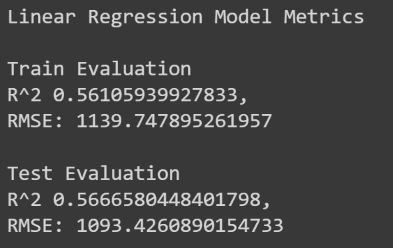
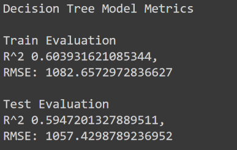

# Understanding Product Properties That Can Help Predict Sales
Author: Robert Ramos

## Overview
The head of a retail chain has asked me to recommend strategies for determining what product characteristics lead to higher sales volume.

I focused my analysis primarily on the total quantity of items sold by item type as well as the type of outlets the products were sold.

## Variables 
Variables used in analysis

|Variable Name|Description   |   
|---|---|
|Item_Identifier|Unique product ID   | 
|Item_Weight |Weight of product| 
|Item_Fat_Content|Whether the product is low fat or regular
| Item_Visibility  |The percentage of total display area of all products in a - store allocated to the particular product  |
| Item_Type  |The category to which the product belongs| 
| Item_MRP  |Maximum Retail Price (list price) of the product   |   
| Outlet_identifier  |Unique store ID   |  
| Outlet_Establishment_Year  | The year in which store was established  |   
| Outlet_Size  | The size of the store in terms of ground area covered  |  
| Outlet_Location_Type  | The type of area in which the store is located  | 
| Outlet_Type  | Whether the outlet is a grocery store or some sort of supermarket  | 
|Item_Outlet_Sales   |  Sales of the product in the particular store. This is the target variable to be predicted|

## Methods
See my [Google Colab](https://colab.research.google.com/drive/1-nYMdKYLTlWY7F99ZTBCMHwFgM3eVi0F#scrollTo=gr63uFrBHyFm) for detailed steps I took to obtain, clean and analyze the data. The general steps were:
* Imported raw data from a csv file into a dataframe
* Cleaned data by dropping columns, correcting inconsistant values, imputing missing values and converting columns to appropriate datatypes
* Create visualizations to explore characteristics of products and how they affect sales
* Create machine learning models to find best fit

## Results
### Item Sales by Outlet Type
Supermarket Type2's had the highest volume of item sales over the other 3 types of outlets combined.

### Item Sales by Item Category
- Highest selling product categories are Fruits and Vegetables, Snack foods and Household products
- Lowest selling item categories are Breakfast, Seafood and products that fall into the Others category

## Summary
Based on the data that I have analyzed, items that will sell highest in quantities are those that are sold in Supermarket Type2 outlets and top products categories that are more likely to sell than others are Fruits and Vegetables, Snack foods and Household products.

## Recommendation
* My recommendation to increase future sales of products would be to focus on building more Type 2 supermarkets as this will lead to the highest volume of sales across all products.
* Both models have a pretty low coefficient of determination which means that is still about 40% of uncertainty when making predictions off of these models however between the two models that we have tested, the Regression Tree model will perform better than a Linear Regression Model.

